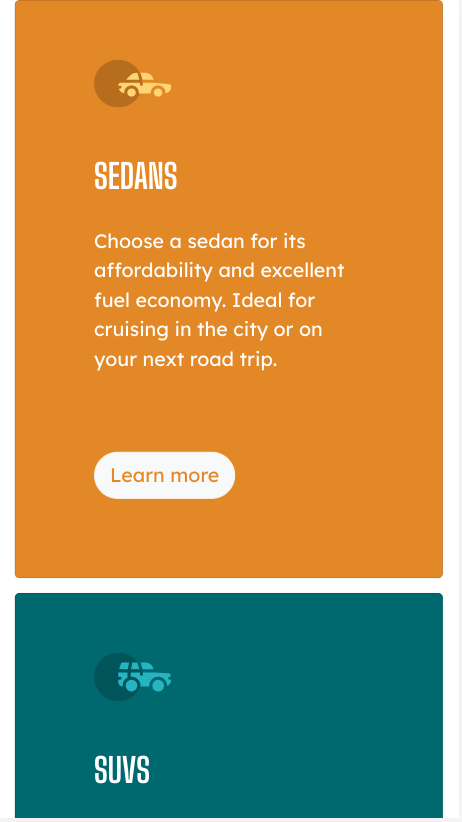

# Frontend Mentor - 3-column preview card component solution

This is a solution to the [3-column preview card component challenge on Frontend Mentor](https://www.frontendmentor.io/challenges/3column-preview-card-component-pH92eAR2-). Frontend Mentor challenges help you improve your coding skills by building realistic projects. 

## Table of contents

- [Overview](#overview)
  - [The challenge](#the-challenge)
  - [Screenshot](#screenshot)
  - [Links](#links)
- [My process](#my-process)
  - [Built with](#built-with)
  - [What I learned](#what-i-learned)
  - [Continued development](#continued-development)
  - [Useful resources](#useful-resources)

## Overview

### The challenge

Users should be able to:

- View the optimal layout depending on their device's screen size
- See hover states for interactive elements

### Screenshot

### Links

- Live Site URL: [Github Pages](https://jdegand.github.io/3-column-preview-card-component/)

## My process

### Built with

- Bootstrap
- CSS custom properties
- Flexbox
- CSS Grid

### What I learned

- Basic boostrap implementation.
- No extra CSS stylesheet

### Continued development

### Useful resources

- [Bootstrap](https://getbootstrap.com/)
- [Bootstrap Card](https://getbootstrap.com/docs/5.1/components/card/)
